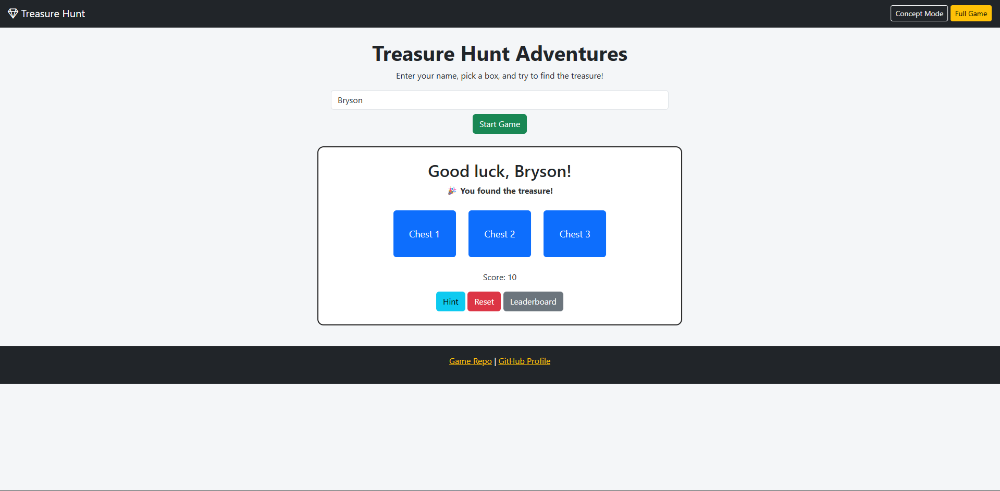

# 🏴‍☠️ Treasure Hunt Adventure

> Search the treasure chests and see if you can find the hidden treasure!

---

## Author

**Bryson Black**

GitHub Profile: [github.com/brysonblack06](https://github.com/brysonblack06)

Course Project

Version 1.0

Date: June 2026

---

## User Story

As a visitor to my GitHub page,

I want to play a simple treasure hunting game,

So that I can have fun while trying to find the hidden treasure.

---

## Narrative

Treasure Hunt Adventure is a simple browser game where players search treasure chests to uncover hidden treasure. Players may enter their name or play as a guest with a randomly generated guest name. The game keeps track of the player's score, offers hints, displays a leaderboard, and allows the player to restart at any time. The goal is to find the treasure using as few attempts as possible.

---

## About the App

### Features

- Enter your name or play as a guest.
- Random guest names for players who do not enter a name.
- Three treasure chests to search.
- Hint button to help locate the treasure.
- Reset button to start a new game.
- Score tracking.
- Leaderboard using browser storage.
- Bootstrap modal for displaying leaderboard information.
- Concept Mode and Full Game navigation.
- Responsive interface using Bootstrap.

---

## Technologies Used

- HTML5
- CSS3
- JavaScript (ES6)
- jQuery
- Bootstrap 5
- Bootstrap Icons
- Visual Studio Code
- Live Server
- GitHub
- GitHub Pages

---

## Project Structure

```
bravo-webgame/
│
├── index.html
├── README.md
│
├── assets/
│   ├── css/
│   │   └── style.css
│   │
│   └── js/
│       └── app.js
│
└── images/
```

---

## Code Example

The Start Game button begins a new game and updates the page with the player's information.

```javascript
$("#startBtn").click(function () {
    startGame();
});
```

This event listens for a click on the Start Game button and calls the `startGame()` function.

---

## Future Improvements

- Add additional levels.
- Add difficulty settings.
- Add sound effects.
- Add animations when opening treasure chests.
- Store high scores online.
- Add more treasure chest choices.
- Improve mobile responsiveness.

---

## Screenshot



---

## Live Demo

Play the game here:

https://brysonblack06.github.io/bravo-webgame/

---

## GitHub Repository

https://github.com/brysonblack06/bravo-webgame

---

## Credits

- Bootstrap 5
- Bootstrap Icons
- jQuery
- GitHub
- Visual Studio Code

---

## License

This project was created for educational purposes as part of a University of North Alabama course.